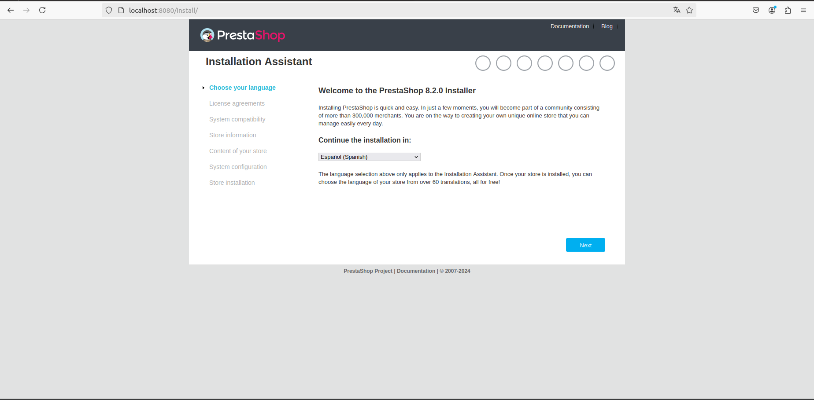

# Tarea_6_SXE

Crear archivo DockerFile con el siguiente comando:
```bash
nano docker-compose.yaml
```
Despues de ejecutar el comando entrariamos en el archivo, y escribiriamos lo siguiente para crear los contenedores de mySQl y PrestaShop con lo necesario:
```bash
services:
  mysql:
    image: mysql:latest # Descarga la última versión de mySQL
    container_name: base_mysql # Nombre del contenedor
    restart: always # Reinicia el contenedor siempre que se cierre.
    environment:
      MYSQL_DATABASE: prestashop_db # Especifica el nombre de la base de datos
      MYSQL_ROOT_PASSWORD: admin # Especifica la contraseña para el superusuario de la cuenta MySQL
    networks:
      - prestashop_network # Red que se va a crear y va a poder ser usada
  prestashop:
    image: prestashop/prestashop:latest # Última versión de prestashop
    container_name: prestashop
    restart: always
    depends_on:
      - mysql # Indica que prestashop depende primero del arranque de mysql 
    ports:
      - 8080:80 # Indica el puerto utilizado
    environment:
      DB_SERVER: mysql # Nombre de la base de datos mysql que se va a utilizar
      DB_NAME: prestashop_db # Sobreescribe el nombre de la base de datos
      DB_USER: root # Sobreescribe el nombre del usuario mysql por defecto
      DB_PASSWD: admin # Sobreescribe la contraseña mysql por defecto
    networks:
      - prestashop_network # Misma red que mysql
networks:
    prestashop_network:
```
Una vez guardado lanzamos el archivo con el siguiente comando:
```bash
sudo docker compose up -d
```
<details>
  <summary>Salida: </summary>
  <br>

[+] Running 38/38
 ✔ prestashop Pulled                                                                      47.8s 
 
   ✔ 302e3ee49805 Pull complete                                                            5.4s 
   
   ✔ 07fc0890b857 Pull complete                                                            5.4s 
   
   ✔ 141aa7d58c57 Pull complete                                                           13.6s 
   
   ✔ 2720d4bca8b3 Pull complete                                                           13.6s 
   
   ✔ 82deca51468c Pull complete                                                           14.4s 
   
   ✔ dec741dfa526 Pull complete                                                           14.4s 
   
   ✔ e204b0efab94 Pull complete                                                           14.4s 
   
   ✔ da3427d4ab01 Pull complete                                                           14.6s 
   
   ✔ 75c32fd90f5c Pull complete                                                           14.6s 
   
   ✔ ea57467a10b9 Pull complete                                                           15.4s 
   
   ✔ 56c9d963ab40 Pull complete                                                           15.4s 
   
   ✔ 7f7723130213 Pull complete                                                           15.4s 
   
   ✔ c2f5f2697bee Pull complete                                                           15.4s 
   
   ✔ 1625592ac8fb Pull complete                                                           17.8s 
   
   ✔ 674b4f597a48 Pull complete                                                           17.8s
   
   ✔ e0f1b6d73bae Pull complete                                                           25.4s 
   
   ✔ 27f8accfd04c Pull complete                                                           25.5s 
   
   ✔ 6456d2dbcb23 Pull complete                                                           25.5s 
   
   ✔ a8b0b857fc53 Pull complete                                                           25.5s 
   
   ✔ cc44b7bfb266 Pull complete                                                           25.5s 
   
   ✔ eaa8e1647d57 Pull complete                                                           25.6s 
   
   ✔ 845a63f5289d Pull complete                                                           25.6s 
   
   ✔ 6dfcfab5167d Pull complete                                                           25.6s 
   
   ✔ 226dd794deb6 Pull complete                                                           25.6s 
   
   ✔ 67bb2aee2876 Pull complete                                                           26.4s 
   
   ✔ c9c071d8c877 Pull complete                                                           46.0s 
   
 ✔ mysql Pulled                                                                           42.0s 
 
   ✔ eba3c26198b7 Pull complete                                                           21.7s 
   
   ✔ 97f7c8c33abe Pull complete                                                           21.8s 
   
   ✔ aa23d877fa04 Pull complete                                                           21.9s 
   
   ✔ a143609ddd2d Pull complete                                                           23.0s 
   
   ✔ 78308a3437c4 Pull complete                                                           23.0s 
   
   ✔ c0880e4b3737 Pull complete                                                           23.2s 
   
   ✔ 4bab267f9ce1 Pull complete                                                           30.4s 
   
   ✔ e575f6d9b17a Pull complete                                                           30.4s 
   
   ✔ 607f86c00053 Pull complete                                                           39.7s 
   
   ✔ cd68caa5febe Pull complete                                                           39.7s 
   
  [+] Running 3/3

 ✔ Network accesodatos_prestashop_network  Cre...                                          0.1s
 
 ✔ Container base_mysql                    Started                                         1.1s 
 
 ✔ Container prestashop                    Started                                         0.7s 
</details>

Comprobacion de que funciono correctamente:



Sigues los pasos hasta llegar al apartado **Configuracion del sistema** en el cual tienes que poner lo siguiente en los subapartados:

.PNG)

Si todo salio correctamente te saldra esta pantalla:

.PNG)

Ahora solo falta el como acceder a la tienda como dice en la imagen anterior tendremos que desinstalar la carpeta install que se hace con el siguiente comando:
```bash
docker exec -it prestashop rm -rf /var/www/html/install
```
Y cambiamos el nombre de la carpeta admin:
```bash
docker exec -it prestashop mv /var/www/html/admin /var/www/html/admin552vw8sb9uvj8ucjobz
```
Y ya estaria entramos a este enlace [http://localhost:8080/admin552vw8sb9uvj8ucjobz](http://localhost:8080/admin552vw8sb9uvj8ucjobz), nos llevara a la pagina de inicio de sesion. 
Una vez iniciado sesion ya podremos administrar nuestra tienda de Prestashop.

.PNG)


